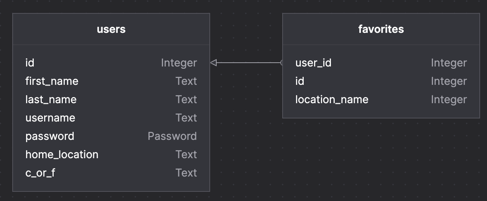

# 4cast
Weather app with up-to-date weather and a 4-day forcast. Search for locations or create an account to add your favorite locations for a customizable homepage! And feel free to check out the climate newsfeed for news on climate change/global warming. 

### Link to Deployment

https://capstone-4cast.herokuapp.com/

### Stack

Python, Flask, SQLAlchemy, WTForms, Javascript, Jinja, HTML/CSS, Bootstrap

### How to Run This Application Locally

To get this application running, make sure you do the following in the Terminal:

1. `git clone git@github.com:esmps/4cast.git`
2. `cd 4cast`
3. `python3 -m venv venv`
4. `source venv/bin/activate`
5. `pip install -r requirements.txt`
6. `createdb 4cast`
7. `cd src`
8. `touch .env`
9. Open the .env file and include the following variables:
    ``` 
    DATABASE_URL='postgresql:///4cast'
    WEATHER_BASE_URL='http://api.weatherapi.com/v1'
    WEATHER_API_KEY={your Weather API key here, you can get one at https://www.weatherapi.com/}
    NEWS_API_KEY={your News API key here, you can get one at https://newsapi.org/}
    SECRET_KEY="yoursecretkeyhere"
    ```
    If you would like to use the tests:
    `TEST_DATABASE_URL='postgresql:///4cast-test'`
10. `python3 seed.py`
11. `flask run`
12. Go to: http://localhost:5000/

### API List

Weather API: https://www.weatherapi.com/docs/

News API: https://newsapi.org/ 

### Schema
